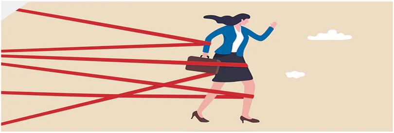
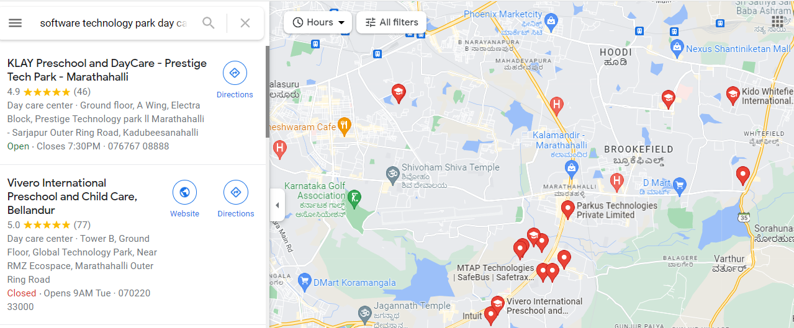

# Mudra- An imprint of life

## Latest statistics about Women Empowerment:

According to a study conducted by the Genpact Centre for Women’s Leadership, about 50 percent of working women in India leave their jobs to take care of their children at the age of 30. Even among those who manage to return, a huge fraction drops out within four months of rejoining the workforce.  The report added that after becoming mothers, only 27 percent of women advance in their careers and continue to be part of the workforce. Of the women who return to employment, a meagre 16 percent advance to hold senior leadership positions. The report was based on a study conducted on women working in the corporate, media, and development sectors.

**The impact on women’s jobs during COVID-19** :

Nearly half of all women said the pandemic had negatively impacted their career paths. Fifty-eight percent are in the process of rejoining the workforce, 48 percent had quit their jobs before COVID-19, 32 percent quit during, and another 20 percent were between jobs.  About 58 percent of women respondents believe that over the last two years, female employees quit their jobs to take on more family responsibilities, such as childcare. Thirty-two percent of women said they quit because of the pandemic, with health concerns (21 percent) and maternity leave (13 percent) the other reasons given.

About 58 percent of women respondents believe that over the last two years, female employees quit their jobs to take on more family responsibilities, such as childcare. Thirty-two percent of women said they quit because of the pandemic, with health concerns (21 percent) and maternity leave (13 percent) the other reasons given. A significant proportion of employers (39 percent) agreed with the view that female employees quit their organisations over the last two years because of family responsibilities. Twenty-seven percent said that a lack of appropriate recognition by management was a significant factor in causing women to quit, and 20 percent believed health and safety concerns, likely driven by the pandemic, were the reason.

A significant proportion of employers (39 percent) agreed with the view that female employees quit their organisations over the last two years because of family responsibilities. Twenty-seven percent said that a lack of appropriate recognition by management was a significant factor in causing women to quit, and 20 percent believed health and safety concerns, likely driven by the pandemic, were the reason.

## Present Situation

More women than men are often forced to take a career break due to personal reasons, including but not limited to pregnancy, childbirth, taking care of children or the elderly. Another reason is the lack of expected career growth or development.

Many of the women does not gets a second chance to reclaim her career. Returning to work after a break still remains tough for a lot of women employees. 

## Inspiration

Due to responsibilities and lack of opportunities many women in our society having lot of skill set are not exploring themselves. Women's great powers of creativity, resilience, and extraordinary tales have created stories that exemplify the ultimate force of womanhood while bringing beauty to their special life.

## Our Solution: Powering women to return to work with help of Azure responsible conversational AI

So after doing rigorous market research and found that the existing solutions / platforms (like job portals, career websites etc) are not tailor made as per their requirements.
   - Transparency is not maintained. So, they often stop taking the initiative itself.
   - UI is not user friendly.
   - No personalization 

So, the solution to this problem can be an AI-based responsible Chatbot called Mudra where women from urban and even rural/remote areas can chat with it and:
  - Find relevant job opportunities nearby
  - Know more details about the job.
  - provide access to resources, education based on the location.
  - Provide child/day care centres near to their office/work locations.

**Bot goals:**
  - Intelligent
  - Fast & Accurate
  - Secure
  - Easy to access

## What it does

We wish to see a nation that develops economically on the global front, then it’s very important to have “Women empowerment”. The actual women empowerment will come by making the women economically independent.**Mudra(ChatBot)** will make an impact for empowering our women by promoting their rights and skills and oppurtunities, with "Mudra" want to see “A woman as the full circle. Within her is the power to create, nurture and transform.”

## How we built it

We had created the bot using the Bot Framework that uses QnA Maker Cognitive AI as well as the Text Translator API

### Create QnA Knowledge Base:

To answer questions from the users a knowledge base been created using a QnA Maker Cognitive AI resource. 
This contains all the knowledge base we need for our bot(Mudra) chat. 

Each message is received from the user and use it to forward the users question to the correct QnA Knowledgebase. From the QnA response sent to the end user.

	Ex: Question. I am housewife, I want to restart my career
	
	Answer. Oh Nice, great decision. There are many work opportunities available (both online and offline) that can be monitored from home.I will let you know all 		
		the possibilities for your career growth.

		Could you please let me know few of the details to find the best career options.

		If you are you Educated,

		type your "highest qualification"

		otherwise press "no"

### Text Translator :

To enable our Bot to talk multiple languages. We have created Text Translator API to translate the conversation to user preferred language.

Mudra bot translates more than 60 languages. We had created a bot with QnA Maker service in combination with the Text Translator to answer questions asked in more    than 60 languages.
 
 	Ex: Question: मैं गृहिणी हूं, मैं अपना करियर फिर से शुरू करना चाहती हूं
 
 	Answer: ओह अच्छा, महान निर्णय. कई काम के अवसर उपलब्ध हैं (ऑनलाइन और ऑफलाइन दोनों) जिन्हें घर से मॉनिटर किया जा सकता है। मैं आपको अपने कैरियर के विकास के लिए सभी संभावनाओं 		 
		को बतादूंगा।

		क्या आप कृपया मुझे सबसे अच्छे कैरियर विकल्पों को खोजने के लिए कुछ विवरणों को बता सकते हैं।

		यदि आप शिक्षित हैं,

		अपनी "उच्चतम योग्यता" लिखें

		अन्यथा प्रेस "नहीं"
 
 
### Bot Framework Emulator:

For testing Mudra, we used Bot Framework Emulator which is a desktop application that allows us to test and debug Mudra bot on localhost or running remotely through a tunnel.

**Sample conversation with Mudra:**

**User Reply**: I am housewife, want to restart my career

**Mudra**: Oh Nice, great decision. There are many work opportunities available (both online and offline) that can be monitored from home.I will let you know all the possibilities for your career growth.

Could you please let me know few of the details to find the best career options.

If you are you Educated,

type your "highest qualification"

otherwise press "no"

**User Reply**: Degree

**Mudra**: Do you have any experience before ?If yes, please type the years of experience ( Ex: 0-1 year, 2-4 years.....)

Otherwise, press no

**User Reply**: 0-1 years

**Mudra**: Let me know your current location ?

**User Reply**: Bangalore/Bengaluru

**Mudra** : Do you have any technical knowledge ? Please list the subjects/Domain you are expert in. ( Data Science, .net, java..... )

Otherwise, type your hobbies/interests

**User Reply**: Data Science

**Mudra**: Thank you, we found the details below, based on your technology selection :

you can see the insights of the hiring trends of the technology to have selected :

https://insights.naukri.com/career-tools/tech-careers/how-to-become-data-analyst

List of Job Recommendations based on your technology selection :

https://insights.naukri.com/career-tools/tech-careers/top-companies-for-data-analyst

Is this helpful ?

**User Reply**: yes

**Mudra** : Thank you 

Hey, you are worrying about your child to take care, while you are leaving to office.

Don't worry. I will let you know the day care centers available near to you.

Let me know the location which you need day care/Child care centers.

**User Reply**: rajaji nagar, banglaore

**Mudra**: 

### Deploy the bot to Azure:

For Deployment we had used azure cli tools and the services provided in the azure environment

## Challenges we ran into

Unfortunately right now we couldn't able to integrate the speech service to the bot due to integrating issues.Finding the right documentation and the services makes us bit difficult to design the solution, but very nice to explore the azure AI services.

## Accomplishments that we're proud of

So, we really do feel proud that we were able to pull it off. Getting familiar with great Microsoft Azure Services(Azure Cognitive services, Azure Applied AI Services or Azure Cognitive Services or Azure Machine Learning ) collecting information, and altogether making things work great. We're really proud of that.

## What we learned

It is apt to say that the process, alone of building a project, whatever it is, holds new knowledge and skills to achieve. 
We did a lot of that: unlocking new knowledge and skills. This includes:
 - Azure Applied AI Services 
 - Azure Cognitive Services 
 - Azure Machine Learning 

## What's next for Mudra- 

The product is only in like v0.0.1. There is much left to do.
Azure speech service integration and with LUIS and QnA maker for better user intent prediction.And also need to make cover all the possible responsible AI principles.All these things and more will go into improving the bot.

